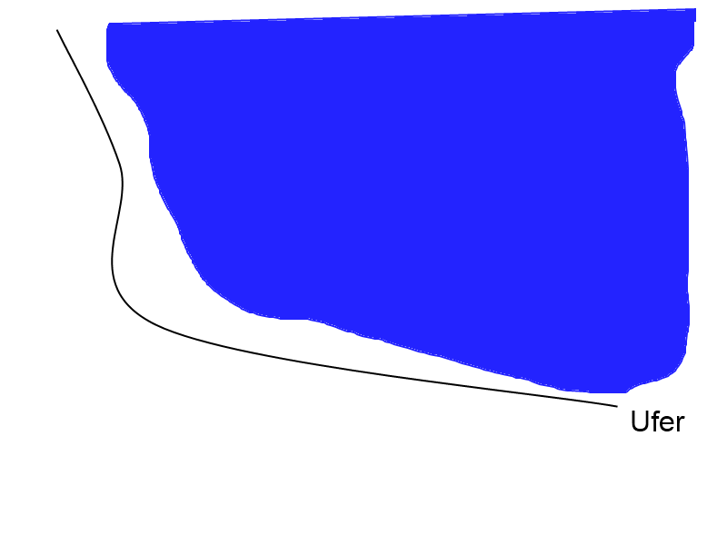

# Hit The Line

Hit the Line ist ein Wurfspiel mit Steinen, bei dem mehrere Spieler gegeneinander antreten. In mehreren Runden versuchen die Spieler nacheinander ihren Wurfstein möglichst nah an eine bestimmte Ziellinie zu befördern. Nachdem der letzte Spieler seinen Wurfstein geworfen hat, wird ein Rundensieger ermittelt und die nächste Runde beginnt.

## Generelles

- Status
    + letzte Änderung: 2018-02-14
    + [ ] Check: 2 bis 5 Spieler geregelt?
    + Freigegeben: Ja/Nein (am 2018-xx-yy, durch DTH, DHO)
- Field of Play: __Classic Weiher__
- Ausrüstung
    + Wurfstein je Spieler,
    + Denystein
- Punkte: 1pt/rd, SPR

## Regeln

1.  __Spielfeld__ Hit the Line wird entlang des Ufers gespielt. Die Spieler legen einen Abstand zu der fixen Uferlinie, der Line, fest. Dieser Abstand bildet ebenfalls eine Linie, die sogenannte Wurflinie. Sie bildet im Idealfall eine Parallele zur Uferlinie. Die Spieler positionieren sich zu jedem Rundenbeginn hinter dieser Linie. 
2.  Die Line ist die Ziellinie des Spiels.
3.  Die Wurflinie sollte mindestens 3 Meter Abstand zur Line haben.
4.  Wird die Wurflinie zählt als Übertreten, sobald der Fuß des werfenden Spielers diese beim Wurf oder noch vor der Landung des geworfenen Steins überschreitet.
5.  __Abseitsregel__ Der erste geworfene Wurfsteins einer jeden Runde gibt einen Bereich vor, in welchem auch die folgenden Wurfsteine landen müssen. Zieht man ein Lot zur Wurflinie durch diesen ersten Wurfstein, so ist dieser Bereich auf +-0,5 Meter parallel zum Lot beschränkt und seiner Länge nach unbeschränkt. (Siehe Bild 2.1) Steine auerhalb dieses Bereichs liegen im Abseits, werden nicht gewertet und durfen in dieser Runde nicht erneut geworfen werden.
6.  __Winkelgesetz__ Der erste geworfene Wurfstein einer jeden Runde muss so platziert werden, dass keiner der anderen Mitspieler an einer beliebigen Position auf der Wurflinie mehr als 1,5mal soweit werfen muss, um seinen Wurfstein auf dem selben Punkt zu platzieren.
7.  Die Spielfläche darf während einer laufenden Runde von keinem Spieler in irgendeiner Hinsicht modifiziert werden.
8.  Vor oder nach jeder Runde durfen Modifikationen an der Spielflche getätigt werden. Die Modifikationen beschränken sich auf die Glättung der Spielfläche.
9.  Nur ein Wurfstein kann in die Wertung eingehen.
10.  In jeder Runde wirft jeder Spieler seinen Wurfstein im Uhrzeigersinn. Die darauffolgende Runde wird vom nächsten Spieler begonnen.
11.  Ein Wurfstein is gültig wenn dieser noch *trocken* bleibt. Der Stein zählt als *trocken*, wenn ein Teil des Steins aus dem wasser ragt. Faustregel: innerhalb von 10 Sekunden keine mehrfachen Wellen über den Stein. Unter Wasser ist ein Wurfstein ungültig.
12.  Der Wurfstein welcher *trocken* (also gültig) ist und am weitesten von der Wurflinie entfernt ist, gewinnt die Runde.

__Deny-Regeln__

1.  Sind zwei Wurfsteine auf der gleichen Höhe (dabei zählt der ganze Umfang des Steins - auch unter Wasser) entfernen diese gegenseitig die Wirkung (werden also ungültig).
2.  Der Spieler der die Runde begonnen hat kann einen Denystein am Ende der Runde werfen. Der Denystein bleibt über das Spiel immer der gleiche.
3.  Ein Denystein entfernt die Wirkung aller Wurfsteine welche auf der selben Höhe liegen (entsprechende Steine)
4.  Einigen sich alle Spieler, kann auch ohne Denystein gepsielt werden.

## Anmerkungen

Sachen die aufgefallen sind und evtl ins Regelbuch mit einfließen müssen.